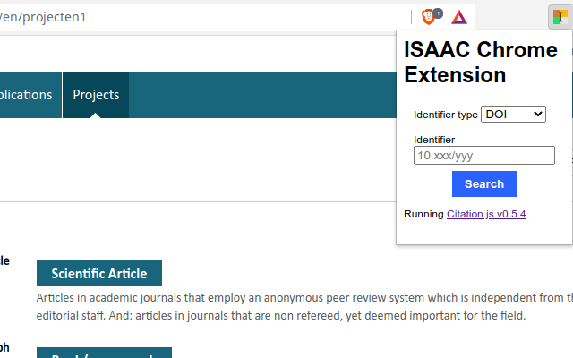

#  isaac-chrome-extension

Chrome Web Extension for support of the [NWO ISAAC platform](https://www.nwo.nl/aanvraagsysteem-isaac). **This extension is not endorsed or developed by the NWO.**

> # ⚠️ Alpha version. Not tested for patents, contracts or publications aimed at the general public

## Install

### Installing from the Chrome Web Store

The extension is [available in the Chrome Web Store](https://chrome.google.com/webstore/detail/isaac-chrome-extension/kiljfbiapahlahhilgcgfkfjnkgggode).

### Installing from GitHub

To install the latest release:

  1. Go to the [latest release](https://github.com/citation-js/isaac-chrome-extension/releases) and download the zip file (e.g. `isaac-chrome-extension-1.0.0.zip`)
  2. Open Chrome and type `chrome://extensions/` (or `brave://extensions/` or `chromium://extensions/` or `edge://extensions/`) in the browser location bar
  3. Enable `Developer mode` in the top right of this page
  4. Drag the zip file to the extensions tab

To install the development version:

  1. Make a check out of this source code repository
  2. Open Chrome and type `chrome://extensions/` (or `brave://extensions/` or `chromium://extensions/` or `edge://extensions/`) in the browser location bar
  3. Enable `Developer mode` in the top right of this page
  4. Click `Load unpacked` and open the `isaac-chrome` folder in the source code repo with the `manifest.json` file

## Usage

  1. Click "Projects", select your project and go to the "Product" tab. There, click "Add".
  2. Select the type of product. The extension can do this automatically, but this process is fallible.
  3. Click the icon of the extension in the top right.

  4. Fill in your DOI, PubMed identifer, or ISBN and click "Search". This takes you to the information of the first author.
  5. Review the author information, optionally add additional info such as the gender and DAI, and click "Next". Repeat until all authors are added.
  6. Review the product information, optionally add additional info such as Open Access status.
  7. Submit.

See also the ISAAC manual ([Dutch](https://www.nwo.nl/sites/nwo/files/media-files/ISAAC_Handleiding_NL.pdf), [English](https://www.nwo.nl/sites/nwo/files/media-files/ISAAC_User_manual_EN.pdf)).

## Dependencies

This code uses [Citation.js](https://citation.js.org), license MIT. Information is collected from CrossRef, Google Books, and Unpaywall.
